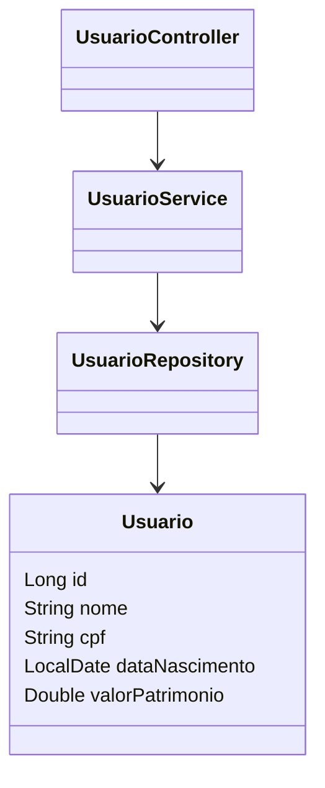

# Meu Patrimônio API

Este é um projeto de API RESTful desenvolvido em Spring Boot para gerenciar informações de usuários, incluindo nome, CPF, data de nascimento e valor do patrimônio.

## Tecnologias Utilizadas

- Spring Boot
- Spring Data JPA
- H2 Database
- SpringDoc OpenAPI (Swagger)
- Gradle

## Configuração do Projeto

### Dependências

No arquivo `build.gradle`, certifique-se de incluir as seguintes dependências:

```groovy
dependencies {
    implementation 'org.springframework.boot:spring-boot-starter-data-jpa'
    implementation 'org.springframework.boot:spring-boot-starter-web'
    implementation 'com.h2database:h2'
    implementation 'org.springdoc:springdoc-openapi-starter-webmvc-ui:2.1.0'
    testImplementation 'org.springframework.boot:spring-boot-starter-test'
}
```
# Documentação da API

## Acesse a documentação do Swagger UI em:

```bash
http://localhost:8080/swagger-ui.html
```
## Endpoints

### Criar Usuário
- **URL:** `/usuarios`
- **Método:** `POST`
- **Corpo da Requisição:**
    ```json
    {
      "nome": "João Silva",
      "cpf": "123.456.789-00",
      "dataNascimento": "1990-01-01",
      "valorPatrimonio": 100000.00
    }
    ```

### Listar Todos os Usuários
- **URL:** `/usuarios`
- **Método:** `GET`

### Buscar Usuário por ID
- **URL:** `/usuarios/{id}`
- **Método:** `GET`

## Diagrama de Classes UML

